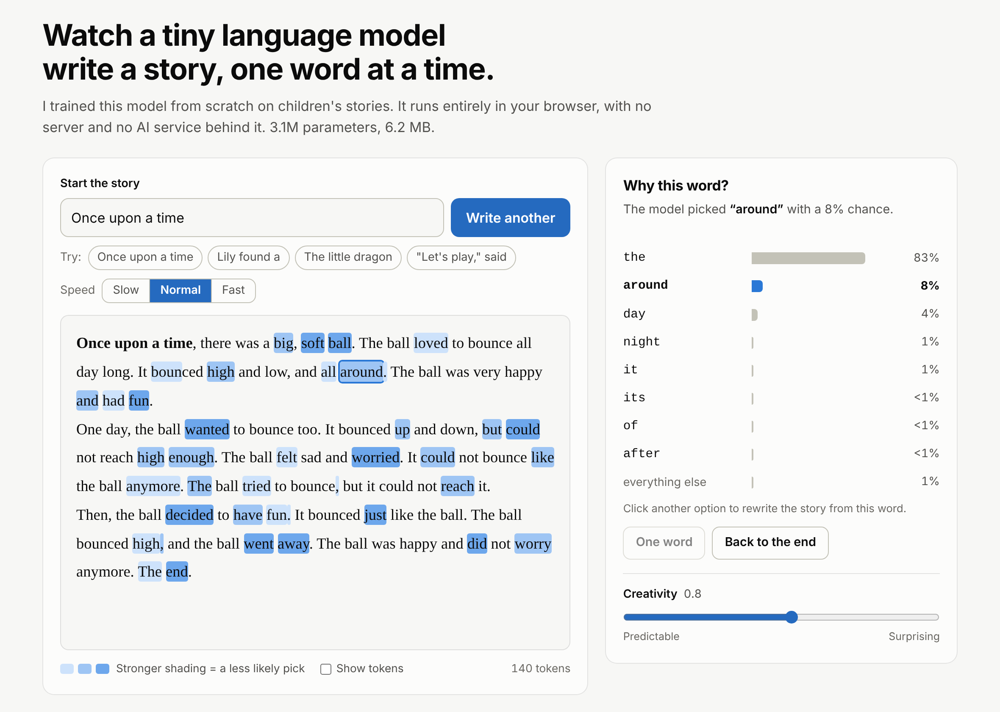

# vAk: a language model trained from scratch

A small GPT-style language model, built and trained from scratch, with a browser demo that shows what the model considered for every word it writes. No pretrained weights, no AI APIs, and no machine-learning libraries in the browser.

This is **vAk-0.1**, the first version: 3.1M parameters, trained on short children's stories.



## Highlights

- **Written from scratch in PyTorch.** A byte-pair-encoding tokenizer, a decoder-only transformer and the training loop, with tests (including one that proves the model cannot see future tokens).
- **Measured.** Two model sizes trained on the same data and compared on held-out text, with loss curves and the limits of the comparison stated.
- **Runs in the browser in plain JavaScript.** The tokenizer and the transformer are re-implemented with no libraries, with a KV cache for speed, and checked against PyTorch every time the page loads.
- **Shows its working.** Live next-token probabilities, "why this word?" for any word in the output, and rewinding to try a different choice.

## Quick start

Requires Python 3.10 or newer. On a Mac, PyTorch needs macOS 14 or newer.

```bash
python3 -m venv .venv
source .venv/bin/activate
python -m pip install -r requirements.txt

python training/test_all.py         # 14 quick tests, no data needed
python training/prepare_data.py     # downloads ~120 MB of stories, builds the tokenizer
python training/train.py --preset tiny
python training/sample.py --prompt "Once upon a time"
```

Training prints its speed and the time left after the first 20 steps. Press Ctrl+C to stop early; the best model so far is kept.

## Model sizes

| Preset | Layers | Heads | Width | Context | Parameters |
| --- | --- | --- | --- | --- | --- |
| `tiny` | 4 | 4 | 128 | 128 tokens | about 1.1M |
| `small` | 6 | 6 | 192 | 256 tokens | about 3.1M |
| `base` | 8 | 8 | 256 | 256 tokens | about 6.8M |

Train another size with `python training/train.py --preset small`. Each run is saved in its own folder under `runs/`.

## Results

Two sizes trained on a MacBook Air (Apple GPU) on 27.9M tokens of TinyStories. Both are scored on the same 399,900 held-out tokens with 128 tokens of context.

| Model | Parameters | Training steps | Training time | Validation loss | Perplexity |
| --- | --- | --- | --- | --- | --- |
| `tiny` | 1.07M | 3,000 | 4 min | 2.200 | 9.0 |
| `small` | 3.10M | 6,000 | 57 min | 1.729 | 5.6 |


What the comparison shows:

- **Size helps at every point in training.** At step 3,000 `small` had a logged validation loss of 1.79 against 2.20 for `tiny`. It was also ahead after seeing the same amount of text: 2.03 at step 1,500, which is the 24.6M tokens `tiny` saw in its whole run.
- **About three times the parameters cut perplexity from 9.0 to 5.6.** A random guesser would score 2,048.
- **The cost is time.** Each `small` step takes about 6.4 times as long (1.7 against 11.2 steps per second). `small` needed about 9 minutes to match the loss `tiny` reached in 4.5.
- **Neither model is overfitting.** Training and validation loss finish within 0.04 of each other for both, so the limit is model size and training time, not the amount of data.
- **The stories differ in the same direction.** `tiny` loops on a phrase and invents non-words. `small` keeps a character and a scene going for several sentences, but still mixes up who is speaking.

Limits of this experiment: one run per size, so differences of a few hundredths are noise; and the two sizes also differ in context length (128 against 256 tokens) and number of steps, not only in parameters.

Full table and the sample stories: [results/RESULTS.md](results/RESULTS.md).

## Experiments

Train more than one size, then build the comparison:

```bash
python training/train.py --preset small
python training/report.py
```

`report.py` scores every trained model on the same held-out stories with the same context length, then writes `results/RESULTS.md` (comparison table and sample stories from identical prompts) and `results/loss_curves.png`.

## Run it in the browser

```bash
python training/export.py --run small
python serve.py
```

Then open http://localhost:8080. `serve.py` serves the `web` folder with browser caching switched off, so edits always show up on reload.

`export.py` saves the weights as 16-bit floats (about 6 MB for `small`) with the tokenizer and a set of reference answers computed by PyTorch. The page loads them and runs the model with a tokenizer and transformer re-implemented in plain JavaScript in `web/js/`, with no libraries. Each new token reuses the attention keys and values of the tokens before it (a KV cache), so generation is fast on a CPU.

What the page does:

- **Live probabilities.** As the model writes, bars show its top guesses for the next token and the chance of each.
- **Why this word?** Click any word in the story to see what else the model considered at that point. Shading marks the less likely picks.
- **Rewrite from any word.** Choose a different option and the story is rewound to that word and continues from your choice.
- **Creativity slider.** Changes the sampling temperature; the bars follow it live, so you can see what temperature does to the distribution.
- **Show tokens.** Outlines the word-pieces the model actually reads and writes.

The footer link and the "Built by" name are set at the top of `web/js/app.js` (`REPO_URL`, `AUTHOR`). To deploy, publish the `web` folder as a static site; nothing needs building.

On every load the page runs a self-test against the PyTorch reference: identical token ids, output scores within 0.001, and identical text when always choosing the most likely token. The same check runs from the command line with `node --test web/tests/parity.test.mjs`.

## What each file does

| File | Purpose |
| --- | --- |
| `training/tokenizer.py` | Byte-pair encoding tokenizer: learns a vocabulary, turns text into token ids and back |
| `training/gpt.py` | The model: embeddings, causal self-attention, MLP blocks, text generation |
| `training/prepare_data.py` | Downloads the stories, trains the tokenizer, saves the text as token ids |
| `training/train.py` | Training loop with learning-rate schedule, evaluation, logging and checkpoints |
| `training/sample.py` | Writes stories with a trained model |
| `training/report.py` | Compares trained models: exact validation loss, perplexity, loss curves, sample stories |
| `training/test_all.py` | Tests, including one that proves the model cannot see future tokens |
| `training/export.py` | Saves a trained model, its tokenizer and PyTorch reference answers for the browser |
| `serve.py` | Local web server for the page, with caching off |
| `web/js/tokenizer.js` | The tokenizer, ported to JavaScript |
| `web/js/model.js` | The transformer forward pass in plain JavaScript, with a KV cache |
| `web/js/generate.js` | Sampling (temperature, top-k) and the story session: write, record alternatives, rewind |
| `web/js/selftest.js` | Compares the JavaScript model with the PyTorch reference answers |
| `web/js/app.js`, `web/index.html`, `web/css/style.css` | The page: story view, probability bars, controls |

## What a run produces

```
runs/<name>/
  ckpt.pt          best model weights (not committed to git)
  log.csv          training and validation loss over time
  config.json      every setting used for the run
  tokenizer.json   the vocabulary the model was trained with
```

## Dataset

[TinyStories](https://huggingface.co/datasets/roneneldan/TinyStories) by Ronen Eldan and Yuanzhi Li, licensed CDLA-Sharing-1.0. The stories use the vocabulary of a young child, which is what lets a model this small learn to write coherent text.
