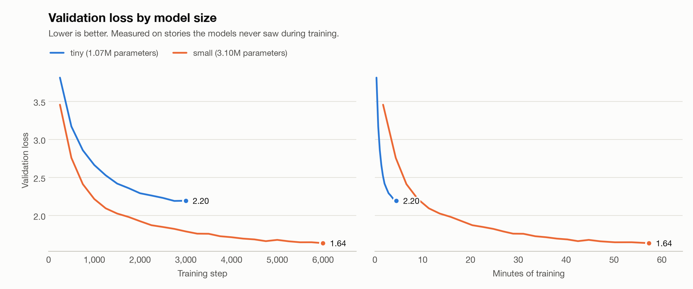

# Results

Generated by `python training/report.py`. Re-run it after training another model; do not edit by hand.

## Setup

- Training data: 27.9M tokens of TinyStories (V2, GPT-4 subset), vocabulary of 2,048 tokens.
- Every model is scored on the same 399,900 held-out tokens, using 128 tokens of context.
- Perplexity is e^loss. A model guessing at random would score 2,048.

## Comparison

| Model | Parameters | Layers x heads x width | Steps | Training time | Validation loss | Perplexity | Loss at full context |
| --- | --- | --- | --- | --- | --- | --- | --- |
| `tiny` | 1.07M | 4 x 4 x 128 | 2,750 | 4 min | 2.200 | 9.0 | 2.200 (128 tokens) |
| `small` | 3.10M | 6 x 6 x 192 | 6,000 | 57 min | 1.729 | 5.6 | 1.640 (256 tokens) |

"Validation loss" and "Perplexity" give every model the same 128 tokens of context, so they compare like with like. "Loss at full context" lets each model use its whole context window; a longer window gives a trained model more of the story to go on, which usually lowers the loss.

The chart shows the loss logged while training: each model at its own full context, estimated from a random sample of batches. Its end points therefore sit near the "Loss at full context" column, not the "Validation loss" column.

`small` has 2.9x the parameters of `tiny` and lowers perplexity from 9.0 to 5.6.

## Sample stories

Same prompts and same random seed for every model (temperature 0.8, top-k 40).

### Prompt: "Once upon a time"

**`tiny`**

> Once upon a time, there was a little dog named Spot. Spot had big bag of food. Every day, Spot would run and play with his toys. They would have fun all day.
> One day, Spot and his friends found a big box. They wanted to find the box, but they could not find it. Spot was very sad. He did not know how to open the box. Spot tried to find his friends, but he could not find the box. He looked around but could not find the box.
> Then, Spot found many things inside. He felt a little ashamed.

**`small`**

> Once upon a time, there was a little dog named Spot. Spot had big ears, and he loved to run and play on the soft grass.
> One sunny day, Spot was playing with his ball in the grass. He was very happy and ran for a long time. But when he tried to grab a stick, he fell down. Spot was sad and didn't know what to do.
> Then, a friendly cat named Whiskers came by. Whiskers saw Spot and said, "Don't be sad, Spot. I will help you go back home." Whiskers was happy and said, "Thank you, Whiskers

### Prompt: "Lily found a"

**`tiny`**

> Lily found a flower and said, "Hello, little flower is my flower. Do you want to be my friend?" TVel nodded and said, "Yes, I want to be my friend."
> Together, they put the flower in the light. They took the flower to the flower and the flower was happy. They learned to be kind and never let the flower fly again.

**`small`**

> Lily found a shiny mint in the kitchen. It was pink and shiny. She picked it up and looked at it. It was dirty.
> "Who did this mint?" Lily asked. "It was my old symbol," Tom said. "It belonged to a girl."
> Lily felt sad. She wanted to find someone to put it by herself. She thought for a moment. Then she had an idea.
> "That's fun," Lily said. "Let's show it to everyone."
> Lily was happy. She put the mint in her
